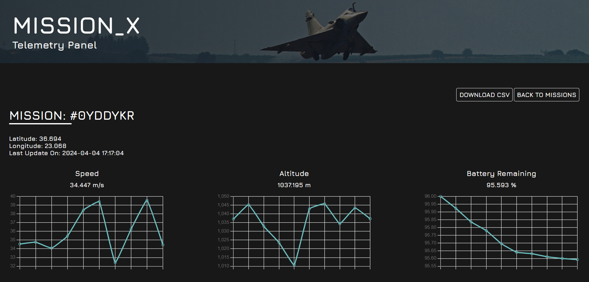
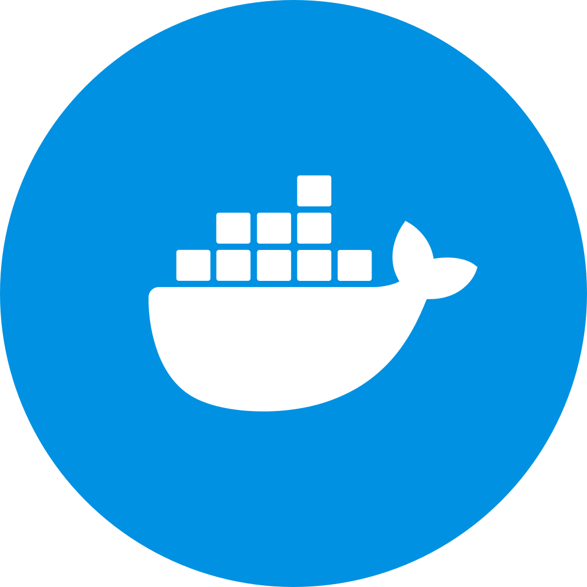

# Mission_X

A web panel for displaying real-time telemetry logs.




## Stack
<div style="display:flex; justify-content: space-between;">

</div>

## Installation

### With Docker:

```bash
docker-compose up --build
```
### Without Docker
Otherwise you must follow the instructions below (recommended only for debugging):

Install required *backend* libraries by running:
```bash
npm install
```

You can run the Fastify backend by running:
```bash
node index.js
```

Install required *frontend* libraries by running:
```bash
npm install
```

Finally, run the React.JS frontend:
```bash
npm start
```

## Usage

### Mission Configuration
Before sending telemetry data, your application must send a *mission configuration* to the server.

The *mission configuration* accepts the following key-value pairs:

*missionID*: A 7 letter ID in order to identify each mission.

*metricsConfiguration*: A JSON object containing key-value pairs. Each key is a mission metric that we want to log and each value is a JSON object that contains the *representation* (used to know how to display the metric in the frontend. For example, representation 'line' makes a line-chart and representation 'number' only displays value as a number), as well as the *units* (the units of the metrics. For example units of speed: 'm/s').

An example *mission configuration* has the following form:
```JSON
{
    "missionID": "A9CDEF7",
    "metricsConfiguration": {
        "speed": {
            "representation": "line",
            "units": "m/s"
        },
        "altitude": {
            "representation": "line",
            "units": "m"
        },
        "battery_remaining": {
            "representation": "line",
            "units": "%"
        },
        "latitude": {
            "representation": "number",
            "units": "",
        },
        "longitude": {
            "representation": "number",
            "units": "",
        },
    }
}
```

After server receives the *mission configuration* it sends a 201 status code response (if it succeeds).

### Mission Telemetry Logs

After *mission configuration* is registered correctly, your application can start sending the *mission telemetry logs* to the server:

*missionID*: The missionID of your mission configuration.

*timestamp*: The time your application sent the log.

*metrics*: A JSON object containing the metrics recorded with their numeric values as key value pairs. (They must be the same with the ones you specified in your *mission configuration* object)

An example *mission telemetry log* is of the form:
```JSON
{
        "missionID": "A9CDEF7",
        "timestamp": 1712242392,
        "metrics": {
            "speed": 72.3,
            "altitude": 1045.3,
            "battery_remaining": 78,
            "latitude": 37.9838,
            "longitude": 23.7275,
        }
    }
```